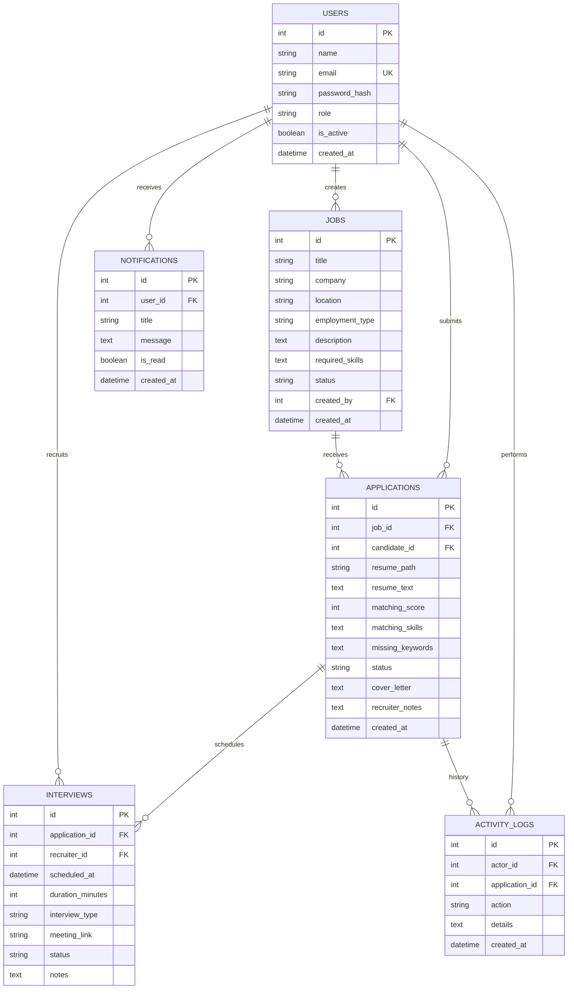

# Database schema / ERD

```mermaid
erDiagram
    USERS ||--o{ JOBS : creates
    USERS ||--o{ APPLICATIONS : submits
    JOBS ||--o{ APPLICATIONS : receives
    APPLICATIONS ||--o{ INTERVIEWS : schedules
    USERS ||--o{ INTERVIEWS : recruits
    USERS ||--o{ ACTIVITY_LOGS : performs
    APPLICATIONS ||--o{ ACTIVITY_LOGS : history
    USERS ||--o{ NOTIFICATIONS : receives

    USERS {
      int id PK
      string name
      string email UK
      string password_hash
      string role
      boolean is_active
      datetime created_at
    }
    JOBS {
      int id PK
      string title
      string company
      string location
      string employment_type
      text description
      text required_skills
      string status
      int created_by FK
      datetime created_at
    }
    APPLICATIONS {
      int id PK
      int job_id FK
      int candidate_id FK
      string resume_path
      text resume_text
      int matching_score
      text matching_skills
      text missing_keywords
      string status
      text cover_letter
      text recruiter_notes
      datetime created_at
    }
    INTERVIEWS {
      int id PK
      int application_id FK
      int recruiter_id FK
      datetime scheduled_at
      int duration_minutes
      string interview_type
      string meeting_link
      string status
      text notes
    }
    ACTIVITY_LOGS {
      int id PK
      int actor_id FK
      int application_id FK
      string action
      text details
      datetime created_at
    }
    NOTIFICATIONS {
      int id PK
      int user_id FK
      string title
      text message
      boolean is_read
      datetime created_at
    }
```

The `applications` table has a unique constraint on `(job_id, candidate_id)` to prevent duplicate applications.
